# 数据结构

## 一.绪论


### 1.1 基本概念

> 【2021 p3 1】
>
> 可以用（）定义一个完整的数据结构
>
> A.数据元素 B.数据对象 C.数据关系 D.抽象数据类型

抽象数据类型描述了**数据的逻辑结构**和**抽象运算**，通常使用（数据对象，数据关系，基本操作集）这样的三元组来表示

D

---

>【2021 p3 2】
>
>以下数据结构中，（）是非线性数据结构
>
>A.树 B.字符串 C.队列 D.栈

树是树形结构，选A

---

> 【2021 p3 3】
>
> 以下属于逻辑结构的是（）
>
> A.顺序表 B.哈希表 C.有序表 D.单链表

顺序表和哈希表以及单链表，既描述**逻辑结构**，又描述**存储结构和数据运算**

有序表是指关键字有序的线性表，仅描述元素之间的逻辑关系，既可以链式存储，也可以顺序存储

选C

---

> 【2021 p3 4】
>
> 以下与存储结构无关的术语是（）
>
> A.循环队列 B.链表 C.哈希表 D.栈

栈是一种逻辑结构，无法表示如何存储

---

> 【2021 p4 5】
>
> 以下关于数据结构的说法中，正确的是（）
>
> A. 数据的逻辑结构独立于其存储结构
>
> B. 数据的存储结构独立于其逻辑结构
>
> C. 数据的逻辑结构唯一决定了其存储结构
>
> D. 数据结构仅由其逻辑结构和存储结构决定

数据的逻辑结构是从面向实际问题的角度出发，只采用抽象表达方式，独立于存储结构；

数据的存储结构是逻辑结构在计算机上的映射，不能独立于逻辑结构而存在；

数据结构的三个要素：**逻辑结构、存储结构、数据运算**缺一不可

---

> 【2021 p4 6】
>
> 在存储数据时，通常不仅要存储各数据元素的值，还要存储（**数据元素之间的关系**）

---

> 【2021 p4 7】
>
> 链式存储设计时，**结点内**的存储单元地址（一定连续）

**不同结点**可以不连续，但是**同一结点内**一定连续的。

---

两种不同的数据结构，他们的逻辑结构和物理结构可能完全相同。比如`二叉树`和二`叉排序树`，

二叉树排序树可以采用二叉树的逻辑表示方式和存储方式，前者通常表示层次关系，后者通常用于排序和查找。

以查找为例，二叉树的时间复杂度为$O(n)$，二叉排序树的时间复杂度为$O(log_2n)$


### 1.2 算法评价

> 【2021 王道 p7 3】
>
> 以下算法的时间复杂度为（）
>
> ```c
> void fun(int n) {
>     int i = 1;
>     while(i <= n) 
>         i = i * 2;
> }
> ```

设`i=i*2`语句运行了t次，$2^t=n$，所以$t=log_2n$​

时间复杂度为$O(log_2n)$

---

> 【2021 王道 p7 7】
>
> 【2014 408统考真题】
>
> 下列程序段的时间复杂度是（）
>
> ```c
> count = 0;
> for(k = 1;  k <= n; k *= 2) 
>     for(j = 1; j <= n; j++)
>         count++;
> ```

我们假设n为2的指数次幂$2^k$​​​，则`for(j = 1; j <= n; j++)`语句执行的次数为t，则有$2^t = n$​，则$t=log_2n$​

而内部`count++`语句在每个循环执行n次，共执行$nlog_2n$​​次

所以时间复杂度为$O(nlog_2n)$​

---

> 【王道 2021 p8 12】
>
> 下面说法中，错误的是（）
>
> I.算法原地工作的含义是指不需要任何额外的辅助空间
>
> II.在相同规模n下，复杂度为O(n)的算法在时间上总是由于复杂度为$O(2^n)$
>
> III.所谓时间复杂度，是指在最坏的情况下估算算法执行时间的一个上界
>
> IV.同一个算法，实现的语言越高级，执行效率越低

算法原地工作指的是算法所需要的辅助空间为常量

所以错误的只有I

---

> 【王道2021 p8 2.1】
>
> 算法所需时间由下列递归方程表示，试求出该算法的时间复杂度的级别
> $$
> T=\left\{  
>              \begin{array}{**lr**}  
>               1,&  n=1\\  
>              2T(n/2)+n, & n>1\\ 
>             
>              \end{array}  
> \right.
> $$
> 式中，n是问题规模，为简单起见，设n是2的整数次幂

🔺记住，这个是所需时间的表达式，不是某个函数的递归表达式，所以直接算结果就行了

设n=$2^k$​，T=2T($2^{k-1}$​)+$2^k$

=2(2T($2^{k-2}$​​)+$2^{k-1}$​​​) + $2^k$​​

=2(2(2T($2^{k-3}$​)+$2^{k-2}$)​​+$2^{k-1}$​​​)+$2^k$​

...

=$2^i$T($2^{k-i}$​)+$i\times 2^{k}$​

最后等于$2^kT(1) + k2^k = 2^k + k2^k = 2^k(k + 1)$

$k = log_2n$

所以原式等于$n(log_2n + 1)$

所以时间复杂度为$O(nlog_2n)$

---

> 该程序段的时间复杂度为？
>
> ```c
> for(int i = 1; i <=n; i++) 
>     for(int j = 1; j <= i; j++) 
>         for(int k = 1; k <= j; k++) 
>             x++;
> ```

将该程序段的时间复杂度计算公式写出来，即$\sum_{i=1}^{n}\sum_{j=1}^i\sum_{k=1}^{j}1$​

$\sum_{j=1}^i\sum_{k=1}^{j}1=\frac{i(i+1)}{2}$​​，即原式为$\sum_{i=1}^{n}\frac{i(i+1)}{2}=\frac{1}{2}+\frac{2}{2}+\cdots+\frac{n}{2}+\frac{1^2}{2}+\frac{2^2}{2}+\cdots+\frac{n^2}{2}=\frac{n(n+1)}{4}+\frac{n(n+1)(2n+1)}{12}$​​

>解：利用恒等式(n+1)³=n³+3n²+3n+1,可以得到：
>(n+1)³-n³=3n²+3n+1,
>n³-(n-1)³=3(n-1)²+3(n-1)+1
>......
>3³-2³=3×(2²)+3×2+1
>2³-1³=3×(1²)+3×1+1.
>把这n个等式两端分别相加，得：
>(n+1)³-1=3(1²+2²+3²+....+n²)+3(1+2+3+...+n)+n,
>由于1+2+3+...+n=(n+1)n/2,
>代入上式得：
>n³+3n²+3n=3(1²+2²+3²+....+n²)+3(n+1)n/2+n
>整理后得：
>1²+2²+3²+....+n²=n(n+1)(2n+1)/6

抓大头，找到最高次幂应该为$\frac{2n^3}{12}=\frac{n^3}{6}$

所以最后的时间复杂度应该为$O(n^3)$

## 二.线性表

### 2.1 顺序表

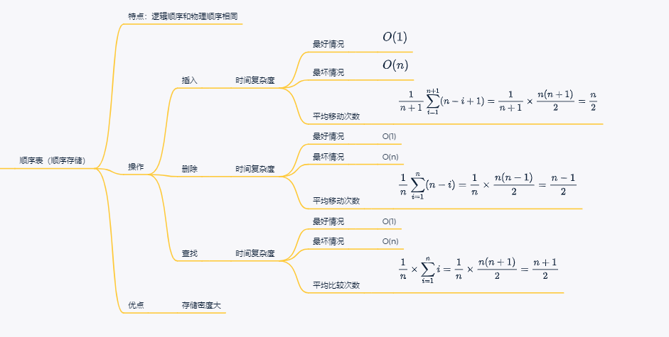

```c
#define MaxSize 50
typedef struct {
    int data[MaxSize];
    int length;
}SqList;

typedef struct {
    int* data;
    int MaxSize, length;
} SeqList;

int listInsert(SqList *L, int i ,int e) {
    if(i < 0 || i > L->length) 
        return 0;
    if(L->length >= MaxSize) {
        printf("Maxsize, can't insert\n");
        return 0;
    }
    for (int j = L->length; j > i; j--) 
        L->data[j] = L->data[j - 1];
    L->data[i] = e;
    L->length++;
    return 1;
}

int listDelete(SqList *L, int i, int *e) {
    if(i < 0 || i >= L->length)
        return 0;
    *e = L->data[i];
    for (int j = i; j < L->length - 1; ++j) 
        L->data[j] = L->data[j+1];
    L->length--;
    return 1;
}

int locateElement(SqList *L, int e) {
    for (int i = 0; i < L->length; ++i)
        if(L->data[i] == e)
            return i;
    return -1;    
}
```


> 【王道 2021 p14 2】
>
> 以下（）是一个线性表
>
> A.由n个实数组成的集合 B.由100个字符组成的序列 C.所有整数组成的序列 D.邻接表

A选项无先后顺序，C无穷，不符合有限性 D是存储结构

---

>【王道2021 p18 4】
>
>若线性表最常用的操作是存取第i个元素及其前驱和后继元素的值，为了提高效率，应该采用（）的存储方式
>
>A.单链表
>
>B.双向链表
>
>C.单循环链表
>
>D.顺序表

直接使用顺序表即可，因为其他链表都必须从首个位置开始依次查询，找到目的位置，所以效率低


> 【王道2021 p19 11】
>
> 顺序表的插入算法中，当n个空间已满时，可再申请增加分配m个空间，若申请失败，则说明系统中没有()可分配的空间
>
> A.m个 B.m个连续 C.n+m个 D.n+m个连续

选D，因为**malloc是申请n+m个新的连续空间，然后将线性表原来的n个元素复制到新申请的n+m个连续的存储空间中**

---

#### 算法题

##### 1

>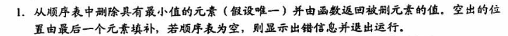
>
>```c
>int del_min(SqList* L, int* res) {
>        if(L->length == 0) return 0;
>        int min = L->data[0];
>        int min_index = 0;
>        for (int i = 1; i < L->length; ++i) {
>            if (L->data[i] < min) {
>                min = L->data[i];
>                min_index = i;
>            }
>        }
>        *res = L->data[min_index];
>        L->data[min_index] = L->data[L->length - 1];
>        L->length--;
>        return 1;
>}
>```
>
>时间复杂度为O(n)


---

##### 2

>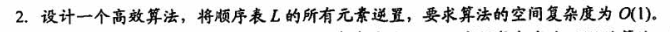
>
>```c
>int reverse_list(SqList *L) {
>        int temp;
>        for (int i = 0; i < L->length / 2; ++i) {
>            temp = L->data[i];
>            L->data[i] = L->data[L->length - 1 - i];//对称的两个位置和应该为n-1，比如第一和最后一个位置分别为
>            //0和n-1，那么他们的和为n-1，即L->length - 1
>            L->data[L->length - 1 - i] = temp;
>        }
>        return 1;
>}
>
>```
>
>时间复杂度为O(n)

---

##### 3🔺

>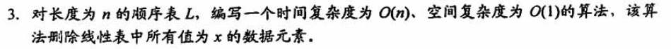
>
>方法一：
>
>```c
>int del_all_x(SqList* L, int x) {
>    if(L->length == 0) return 0;
>    int k = 0;
>    for (int i = 0; i < L->length; ++i) {
>       if (L->data[i] != x)
>           L->data[k++] = L->data[i];
>    }
>    L->length = k;
>    return 1;
>}
>```
>
>方法二：
>
>```c
>int del_all_x2(SqList* L, int x) {
>    if(L->length == 0) return 0;
>    int i = 0;
>    int k = 0;
>    while(i < L->length) {
>        if (L->data[i] == x)
>            k++;
>        else
>            L->data[i - k] = L->data[i];
>        i++;
>    }
>    L->length -= k;
>    return 1;
>}
>```
>
>方法三：
>
>双指针做法
>
>```c
>int del_all_x3(SqList *L, int x) {
>    int h = 0;
>    int t = L->length - 1;
>    while(h < t) {
>        while(h < t && L->data[h] != x)
>            h++;
>        while(t > h && L->data[t] == x)
>            t--;
>        int temp = L->data[h];
>        L->data[h] = L->data[t];
>        L->data[t] = temp;
>    }
>    L->length = h;
>    return 1;
>}
>```
>
>> 例如1 6 8 2 7 4 2 2
>>
>> ```
>> *****************************第一轮
>> h             t
>> ↓             ↓
>> 1 6 8 2 7 4 2 2
>> -----------------------------
>>   h           t
>>   ↓           ↓
>> 1 6 8 2 7 4 2 2
>> -----------------------------
>>     h         t
>>     ↓         ↓
>> 1 6 8 2 7 4 2 2
>> -----------------------------
>>       h       t
>>       ↓       ↓
>> 1 6 8 2 7 4 2 2
>> -----------------------------
>>       h     t
>>       ↓     ↓
>> 1 6 8 2 7 4 2 2
>> -----------------------------
>>       h   t
>>       ↓   ↓
>> 1 6 8 2 7 4 2 2
>> -----------------------------
>>       h   t                  交换
>>       ↓   ↓
>> 1 6 8 4 7 2 2 2
>> *****************************第二轮
>>       h   t                 
>>       ↓   ↓
>> 1 6 8 4 7 2 2 2
>> -----------------------------
>>         h t                 
>>         ↓ ↓
>> 1 6 8 4 7 2 2 2
>> -----------------------------
>>           h                  两个指针重合，运行结束
>>           t                 
>>           ↓
>> 1 6 8 4 7 2 2 2
>> ```
>>
>> **这种做法会改变相对位置，比如7和4**


---

##### 4

>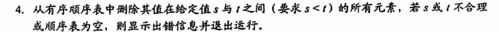
>
>方法一：
>
>```c
>/**
> * 删除数组中s与t之间的元素
> * @param L 有序顺序表
> * @param s
> * @param t
> * @return
> */
>int del_s_t(SqList* L, int s, int t) {
>    int k = 0;//k记录在s,t之间的数的数量
>    int j = 0;//结果指针
>    if (s >= t || L->length == 0) {
>        printf("参数不合理\n");
>        return 0;
>    }
>    for (int i = 0; i < L->length; ++i) {
>        if(L->data[i] >= s && L->data[i] <= t)
>            k++;
>        else
>            L->data[j++] = L->data[i];
>    }
>    L->length -= k;
>    return 1;
>}
>```
>
>> 仿照第三题方法一的思想，就可以了
>
>方法二
>
>双指针思想，自认为不太简便
>
>```c
>int del_s_t2(SqList* L, int s, int t) {
>    int i = 0, j = L->length - 1;
>    for (; i < L->length && L->data[i] < s; i++);
>    if(i == L->length)
>        return 0;//不存在s与t之间的数据
>    for (; j >= 0 && L->data[j] > t; j--);
>    j++;//因为j是从后往前找，找到的是最后一个符合s~t之间的元素，
>    //加一后，是第一个大于t的元素
>    while(j < L->length)
>        L->data[i++] = L->data[j++];
>    L->length = i;
>    return 1;
>}
>```


##### 5

> 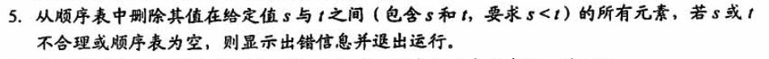
>
> 与第四题方法一类似，不赘述
>
> ```c
> /**
>  * 删除数组中s与t之间的元素
>  * @param L 顺序表
>  * @param s
>  * @param t
>  * @return
>  */
> int del_s_t(SqList* L, int s, int t) {
>     int k = 0;//k记录在s,t之间的数的数量
>     int j = 0;//结果指针
>     if (s >= t || L->length == 0) {
>         printf("参数不合理\n");
>         return 0;
>     }
>     for (int i = 0; i < L->length; ++i) {
>         if(L->data[i] >= s && L->data[i] <= t)
>             k++;
>         else
>             L->data[j++] = L->data[i];
>     }
>     L->length -= k;
>     return 1;
> }
> ```

##### 6

> 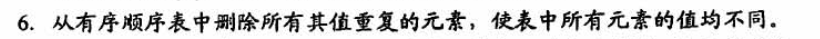
>
> ```c
> /**
>  * 删除有序数组中的重复元素
>  * @param L 有序顺序表
>  * @return
>  */
> int del_dup(SqList* L) {
>     int i = 1;
>     int k = 0;
>     for (; i < L->length; i++)
>         if(L->data[i] != L->data[k])
>             L->data[++k] = L->data[i];
>     L->length = k + 1;
>     return 1;
> }
> ```


##### 7

> 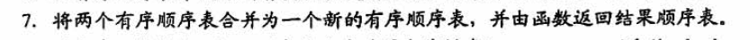
>
> ```c
> int merge_list(SqList A, SqList B, SqList* C) {
>     int i = 0, j = 0;
>     int k = 0;
>     C->length = 0;
>     while(i < A.length && j < B.length) {
>         if(A.data[i] < B.data[j]) {
>             C->data[k++] = A.data[i++];
>         } else {
>             C->data[k++] = B.data[j++];
>         }
>         C->length++;
>     }
>     while(i < A.length) {
>         C->data[k++] = A.data[i++];
>         C->length++;
>     }
>     while(j < B.length) {
>         C->data[k++] = B.data[j++];
>         C->length++;
>     }
>     return 1;
> }
> ```

##### 8🔺

> 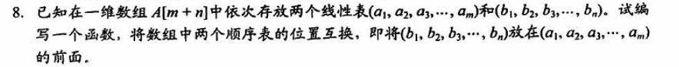
>
> 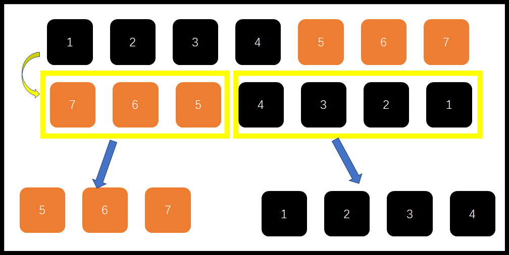
>
> 首先来看看这样写对吗：
>
> ```c
> int reverse(SqList* L, int start, int end) {
>     if(L->length == 0) return 0;
>     int temp;
>     for (int i = start; i <= (start + end) / 2; ++i) {
>         temp = L->data[i];
>         L->data[i] = L->data[start + end - i];
>         L->data[start + end - i] = temp;
>     }
>     return 1;
> }
> 
> int reverse_a_b(SqList* L, int m, int n) {
>     if(m + n != L->length) return 0;
>     reverse(L, 0, L->length - 1);
>     reverse(L, 0, m - 1);
>     reverse(L, m, L->length - 1);
>     return 1;
> }
> ```
>
> 测试一下结果
>
> ```c
> 输入：1 3 5 7 9 2 4 6
> 输出：7 9 2 4 6 1 3 5
> ```
>
> 很明显不对，
>
> 因为这一步
>
> ```c
> reverse(L, 0, m - 1);
> reverse(L, m, L->length - 1);
> ```
>
> 既然第一步已经把整个数组逆转了，那么现在应该是原来在后面的n个数据在前面，应该写
>
> ```c
> int reverse(SqList* L, int start, int end) {
>     if(L->length == 0) return 0;
>     int temp;
>     for (int i = start; i <= (start + end) / 2; ++i) {
>         temp = L->data[i];
>         L->data[i] = L->data[start + end - i];
>         L->data[start + end - i] = temp;
>     }
>     return 1;
> }
> 
> int reverse_a_b(SqList* L, int m, int n) {
>     if(m + n != L->length) return 0;
>     reverse(L, 0, L->length - 1);
>     reverse(L, 0, n - 1);
>     reverse(L, n, L->length - 1);
>     return 1;
> }
> ```

##### 9

> 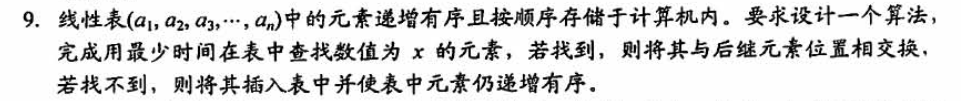
>
> ```c
> int find_insert(SqList* L, int x) {
> 
>     int left = 0, right = L->length - 1;
> 
>     while(left <= right) {
>         int mid = (left + right) / 2;
>         if(L->data[mid] == x) {
>             if(mid < L->length - 1) {
>                 int temp = L->data[mid];
>                 L->data[mid] = L->data[mid + 1];
>                 L->data[mid + 1] = temp;
>                 return 1;
>             } else return 0;//目标数据在最后一位，没有后继元素
>         } else if(L->data[mid] < x) {
>             left = mid + 1;
>         } else {
>             right = mid - 1;
>         }
>     }
> 
>     // 如果到最后一步，left == right，两个指针重合，但是没有找到目标数据
>     // 那么：
>     // 假设重合位置的数据小于x，left++，重合位置的后一位应该就是插入位置，而left++后，left指针正好指向了插入位置
>     // 假设重合位置的数据大于x，right--，如果重合位置大于x，这个位置就是插入位置，left不变，则left依然指向插入位置
>     // 可以得出这么一个结论，如果数据中没有目的元素x，那么最终left指针指向的是第一个大于x的位置，right指针指向的是第一个小于x的位置
>     // 如果你想要插入x，则需要在left处插入即可
>     int i = L->length;
>     while(i > left) {
>         L->data[i] = L->data[i - 1];
>         i--;
>     }
>     L->data[left] = x;
>     L->length++;
>     return 1;
> }
> ```

##### 10

> 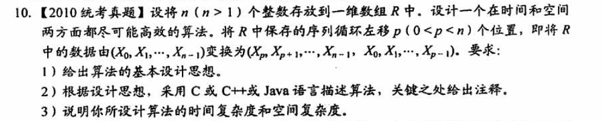
>
> 1).基本思想
>
> 循环左移p个位置，可以将整个数组先逆序，然后将后p个数据与前n-p个数据分别逆序，即先将数组$X_0,X_1\cdots,X_{n-1}$变成$X_{n-1},X_{n-2},\cdots,X_1, X_0$​，再分别逆序前n-p与后p位
>
> 2).算法
>
> ```c
> int reverse(int L[], int len, int start, int end) {
>     if(len == 0) return 0;
>     for (int i = start; i <= (start + end) / 2; ++i) {
>         int temp = L[i];
>         L[i] = L[start + end - i];
>         L[start + end - i] = temp;
>     }
>     return 1;
> }
> int left_swift(int L[], int len, int p) {
>     p = p % len;
>     reverse(L, len, 0, len - 1);// 逆转整个数组
>     reverse(L,len, 0, len - p - 1);// 逆转前n-p个
>     reverse(L, len, len - p, len - 1);// 逆转后p个
>     return 1;
> }
> 
> ```
>
> 3).复杂度
>
> 三个reverse函数的时间复杂度分别为O((n-p)/2)，O(p/2)，O(n/2)，所以总的时间复杂度为O(n)，由于没有用到额外的空间，是在数组原地操作，空间复杂度为O(1)
>
> ---
>
> 方法二：
>
> 我们上面采用的是ab——>$b^{-1}a^{-1}$——>ba的方式
>
> 当然也可以采用ab——>$a^{-1}b^{-1}$——>ba的方式，而且这种方式不容易出错
>
> ```c
> int reverse(int L[], int len, int start, int end) {
>     if(len == 0) return 0;
>     for (int i = start; i <= (start + end) / 2; ++i) {
>         int temp = L[i];
>         L[i] = L[start + end - i];
>         L[start + end - i] = temp;
>     }
>     return 1;
> }
> 
> int left_swift2(int L[], int len, int p) {
>     p = p % len;
>     reverse(L, len, 0, p - 1);
>     reverse(L, len, p, len - 1);
>     reverse(L, len, 0, len - 1);
>     return 1;
> }
> ```


##### 11🔺

> 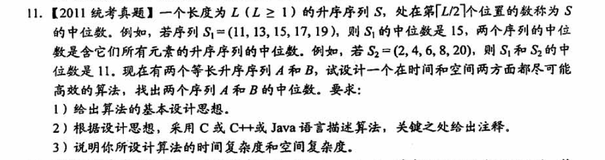
>
> 方法一：用合并数组的思想
>
> 我们利用合并数组的思想，利用两个指针分别指向两个数组，由于两个数组的长度一样，所以中位数一定是位于合并数组的第L位，那么我们循环N次，每次从两个数组的指针处取出最小的数并后移该指针，用一个temp变量记录该值，循环L次后便可以得到中位数。
>
> ```c
> int middle_number(const int A[], const int B[], int len) {
>   int temp;
>   int i = 0, j = 0;
>   for (int k = 0; k < len; ++k) {
>       if(A[i] <= B[j]) {
>           temp = A[i++];
>       } else {
>           temp = B[j++];
>       }
>   }
>   return temp;
> }
> ```
>
> 时间复杂度为O(N)，空间复杂度为O(1)
>
> 方法二：
>
> 如果是奇数的话，假设每个数组有2n+1个元素，那么合并后的中位数一定是第2n+1位
>
> 
>
> 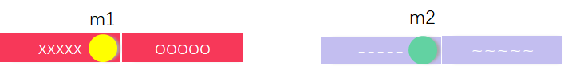
>
> 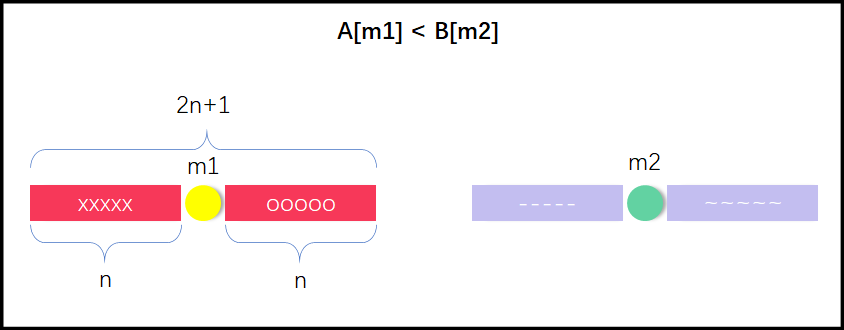
>
> 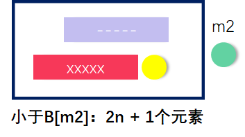
>
> 很明显，m2是没有机会成为第2n+1个元素的，但是m1是可以的
>
> 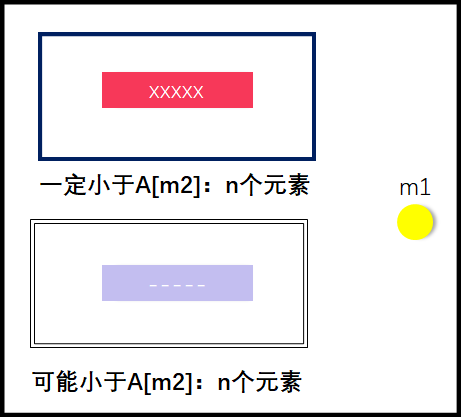
>
> 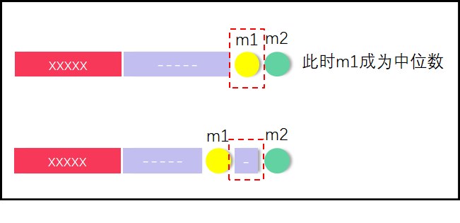
>
> 当为奇数的时候，A的中位数是可以成为合并后的中位数的，那么我们来考虑一下，两个数组都为奇数的时候，那些位置可以有成为中位数的机会
>
> 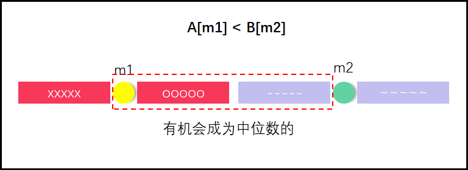
>
> 这位老兄给了我启发
>
> > 在这里我们需要从中学知识中的找中位数的思维中跳出来，即两端划去一个最大值和一个最小值，直到只剩中位数。我们可以知道，**在序列中我们只要划去了相同数量的比中位数大的元素和比中位数小的元素，那么中位数的位置是不变的，即中位数不变**。
> >
> > ————————————————
> > 版权声明：本文为CSDN博主「DeluxeZ」的原创文章，遵循CC 4.0 BY-SA版权协议，转载请附上原文出处链接及本声明。
> > 原文链接：https://blog.csdn.net/weixin_43541528/article/details/107735954
>
> 虽然我们只需要红框中的这几个，但是A中我仅仅删除了前n个，那么B中我也只能删除后n个，即使m2位置上的数不可能成为中位数，我们也要保留着它。只有这样才能保证接下来仍然是两个偶数数组在进行比较
>
> 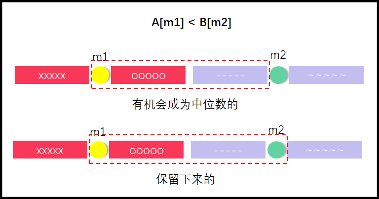
>
> 偶数情况：
>
> 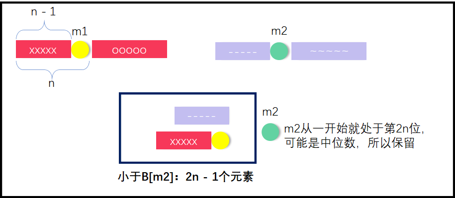
>
> 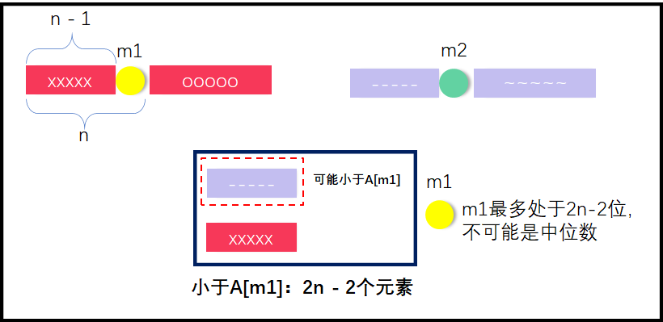
>
> 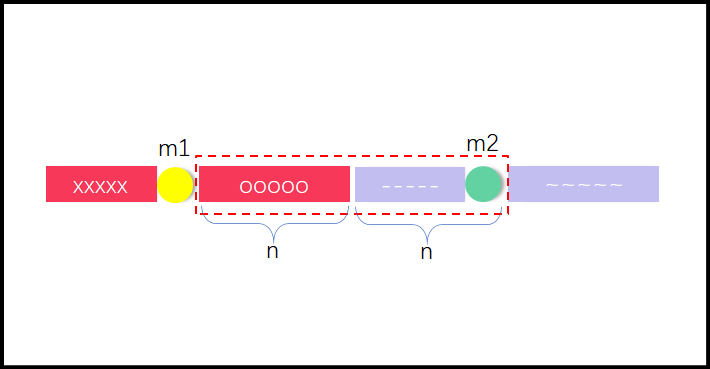
>
> 按照对称原理，我们不需要保留m1位置
>
> ```c
> int middle_number2(const int A[], const int B[], int len) {
>     int a_left = 0, a_right = len - 1;
>     int b_left = 0, b_right = len - 1;
>     while(a_left != a_right || b_left != b_right) {
>         int m1 = (a_left + a_right) / 2;
>         int m2 = (b_left + b_right) / 2;
>         int size = a_right - a_left + 1;
>         if(A[m1] == B[m1]) return A[m1];
>         else if(A[m1] < B[m2]) {
>             if(size % 2 == 1) {//若元素个数为奇数
>                 a_left = m1;//舍弃中间点之前的部分，保留中间点
>                 b_right = m2;//舍弃中间点之后的部分，保留中间点
>             } else {
>                 a_left = m1 + 1;//舍弃中间点以及中间点之前的部分
>                 b_right = m2;//舍弃中间点之后的部分，保留中间点
>             }
> 
>         } else {
>             if(A[m1] > B[m2]) {
>                 if(size % 2 == 1) {
>                     a_right = m1;
>                     b_left = m2;
>                 } else {
>                     a_right = m1;
>                     b_left = m2 + 1;
>                 }
>             }
>         }
>     }
>     return A[a_left] < B[b_left] ? A[a_left] : B[b_left];
> } 
> ```
>


##### 12

> 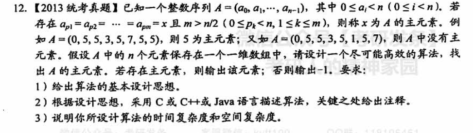
>
> 摩尔投票法，顺序遍历这个数据，用变量temp记录到目前位置时的可能的主元素，然后重新计数，判断是否真的是主元素
>
> 算法步骤：
>
> 1.依次扫描数组，将第一个出现的数保存到temp中，记录该数的出现次数count为1，如果遇到的下一个仍为temp，则count++，如果不是且count>0，则count--；如果不是temp且count=0，则将temp重置为目前遍历的数字，重复上述过程
>
> 2.依次遍历整个数组，记录temp出现的次数，判断是否是大于数组长度的一半，如果大于则返回temp，如果小于等于则返回-1
>
> *这道题leetcode上也有，大家可以尝试去leetcode上刷一下，验证一下正确性，而且上面很多解析*
>
> > [面试题 17.10. 主要元素](https://leetcode-cn.com/problems/find-majority-element-lcci/)
> >
> > 难度简单180
> >
> > 数组中占比超过一半的元素称之为主要元素。给你一个 **整数** 数组，找出其中的主要元素。若没有，返回 `-1` 。请设计时间复杂度为 `O(N)` 、空间复杂度为 `O(1)` 的解决方案。
> >
> >  
> >
> > **示例 1：**
> >
> > ```
> > 输入：[1,2,5,9,5,9,5,5,5]
> > 输出：5
> > ```
> >
> > **示例 2：**
> >
> > ```
> > 输入：[3,2]
> > 输出：-1
> > ```
> >
> > **示例 3：**
> >
> > ```
> > 输入：[2,2,1,1,1,2,2]
> > 输出：2
> > ```
> >
> > 通过次数65,211
> >
> > 提交次数114,159
> >
> > 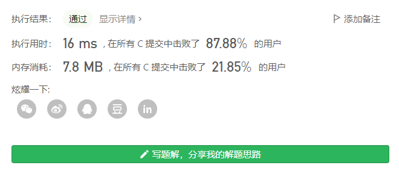
>
> ```c
> int find_main_number(int a[], int n) {
>     int temp = a[0];
>     int count = 1;
>     for (int i = 1; i < n; ++i) {
>         if(a[i] == temp) {
>             count++;
>         } else {
>             if(count == 0) {
>                 temp = a[i];
>                 count = 1;
>             } else {
>                 count--;
>             }
>         }
>     }
>     count = 0;
>     for (int i = 0; i < n; ++i) {
>         if(a[i] == temp) count++;
>     }
>     return count > (n / 2) ? temp : -1;
> }
> ```
>
> 由于循环遍历了两次，所以主体运行次数为2N，故总时间复杂度为O(N)，空间复杂度为O(1)

##### 13

> 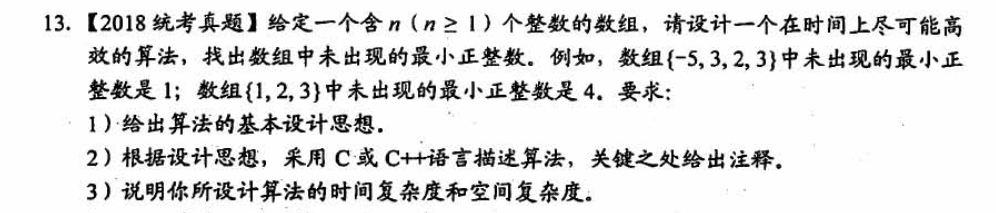
>
>  用一个数组record记录从1到n的整数出现情况，遍历给定的数组，1~n之间的数出现，则将对应位置下的record元素记为1
>
> 接下来遍历整个record数组，找到第一个为0的位置，返回该位置
>
> 否则返回n+1
>
> ```c
> int find_lost(int a[], int n) {
>     int record[n];
>     for (int i = 0; i < n; ++i) {
>         record[n] = 0;
>     }
>     for (int i = 0; i < n; ++i) {
>         if(a[i] > 0 && a[i] <= n) {
>             record[a[i] - 1] = 1;
>         }
>     }
> 
>     for (int i = 0; i < n; ++i) {
>         if(record[i] == 0) return i + 1;
>     }
> 
>     return n + 1;
> }
> ```
>
> > [41. 缺失的第一个正数](https://leetcode-cn.com/problems/first-missing-positive/)
> >
> > 难度困难1147
> >
> > 给你一个未排序的整数数组 `nums` ，请你找出其中没有出现的最小的正整数。
> >
> > 请你实现时间复杂度为 `O(n)` 并且只使用常数级别额外空间的解决方案。
> >
> >  
> >
> > **示例 1：**
> >
> > ```
> > 输入：nums = [1,2,0]
> > 输出：3
> > ```
> >
> > **示例 2：**
> >
> > ```
> > 输入：nums = [3,4,-1,1]
> > 输出：2
> > ```
> >
> > **示例 3：**
> >
> > ```
> > 输入：nums = [7,8,9,11,12]
> > 输出：1
> > ```
> >
> >  
> >
> > **提示：**
> >
> > - `1 <= nums.length <= 5 * 105`
> > - `-231 <= nums[i] <= 231 - 1`
> >
> > 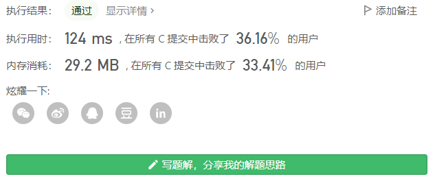


##### 14

> 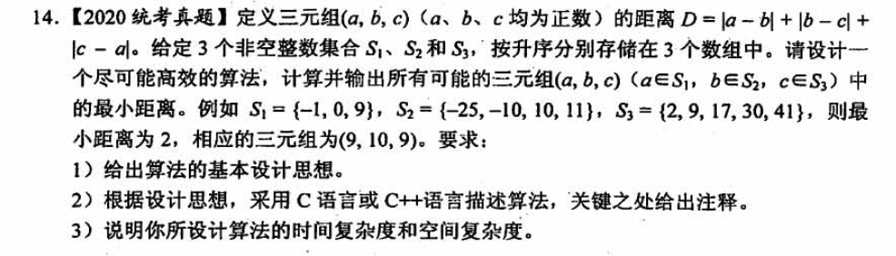
>
> > ```c
> > #define INT_MAX 0x7fffffff
> > 
> > int get_dis(int a, int b) {
> >     return a > b ? a - b : b - a;
> > }
> > 
> > int is_min(int a, int b, int c) {
> >     if(a <= b && a <= c) return 1;
> >     return 0;
> > }
> > int min_dis(int S1[], int len1, int S2[], int len2, int S3[], int len3) {
> >     int min_dis = INT_MAX;
> >     int i = 0, j = 0, k = 0;
> >     while(i < len1 && j < len2 && k < len3 && min_dis > 0) {
> >         int d = get_dis(S1[i], S2[j]) + get_dis(S1[i], S3[k]) + get_dis(S2[j], S3[k]);
> >         if(d < min_dis) min_dis = d;
> >         if(is_min(S1[i], S2[j], S3[k])) i++;
> >         else if(is_min(S2[j], S1[i], S3[k])) j++;
> >         else k++;
> >     }
> >     return min_dis;
> > }
> > ```

### 2.2 链表

> 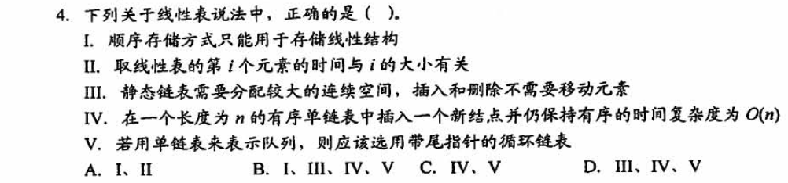
>
> 选D
>
> I：顺序存储方式也可以用来存储静态链表
>
> II：线性表随机存取
>
> V：单链表表示队列，先进先出，输出需要访问头节点，插入需要访问尾结点，所以需要带尾指针的循环链表，这样访问的时间复杂度为1


> 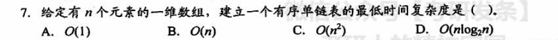
>
> 方法一：插入排序
>
> 如果使用插入排序，总共遍历了n个数组元素，取得一个数组元素，还要去链表中寻找合适的插入的位置，$O(n^2)$
>
> 方法二：先排序
>
> 效率最高的排序算法的时间复杂度为$O(n\log{n})$
>
> 然后用有序数组建立链表，时间复杂度为$O(n)$
>
> $O(n) + O(n\log{n}) = O(n\log{n})$​


> 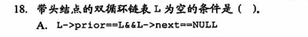
>
> 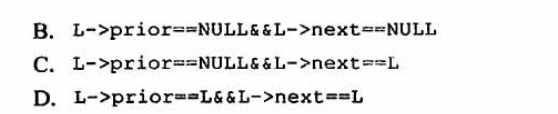
>
> 选D，记住就行
>
> 

> 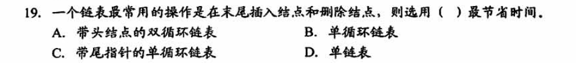
>
> 看清楚，C是带尾指针的“单循环链表”，没办法快速找到最后结点的前驱结点，故速度不如带头结点的双循环链表快

> 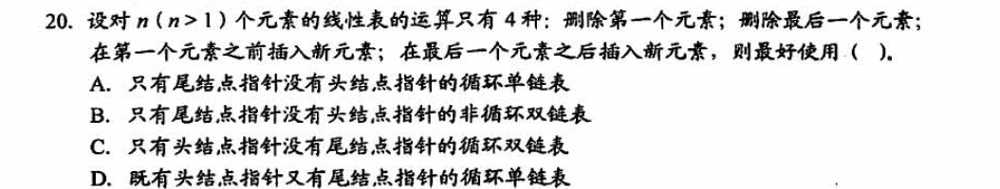
>
> 分清双向和单向，选C


## 八.排序

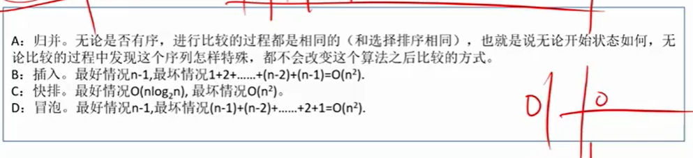

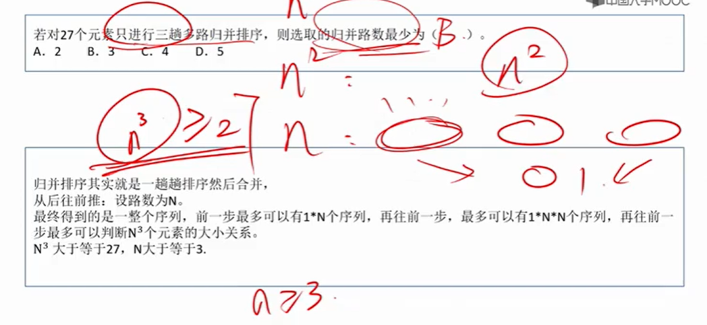

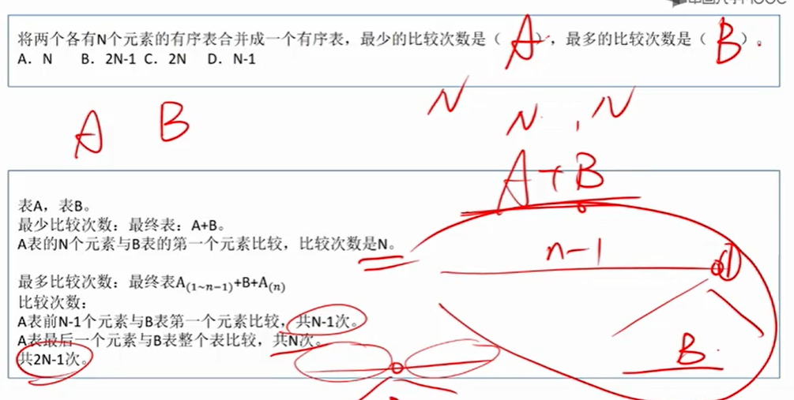

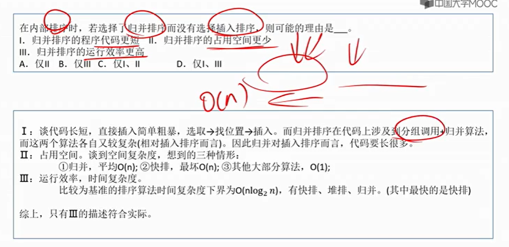

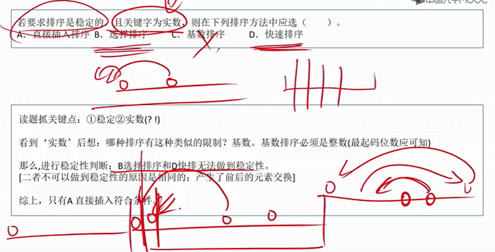

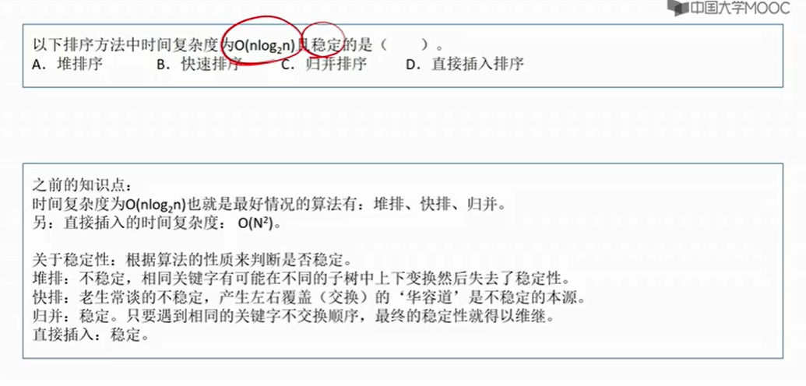

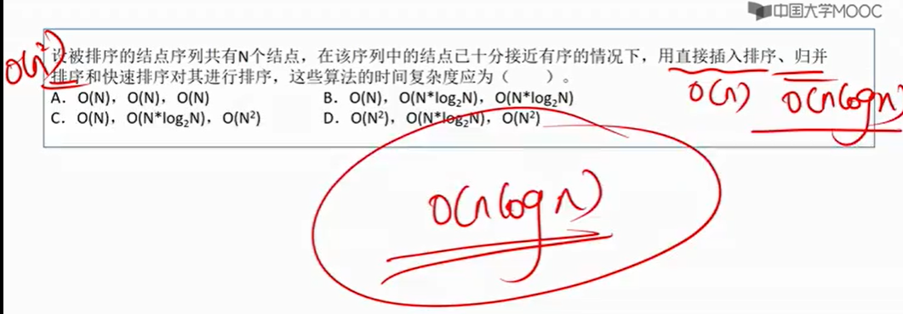

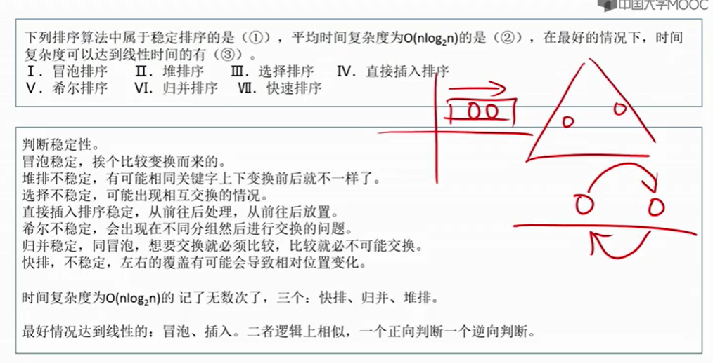

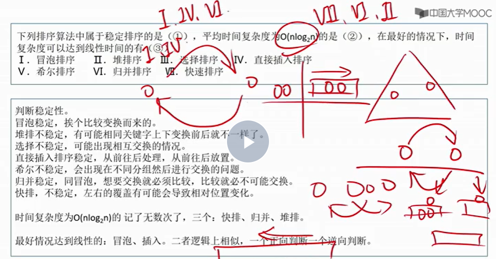

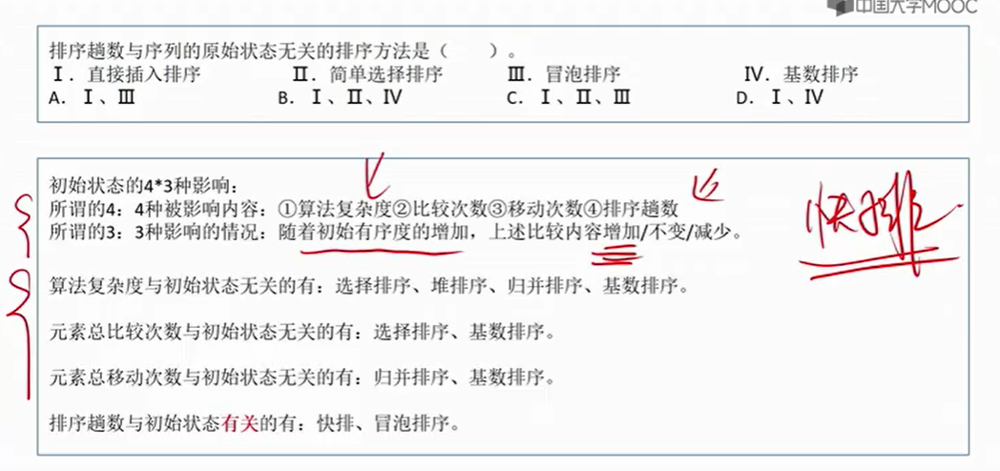
